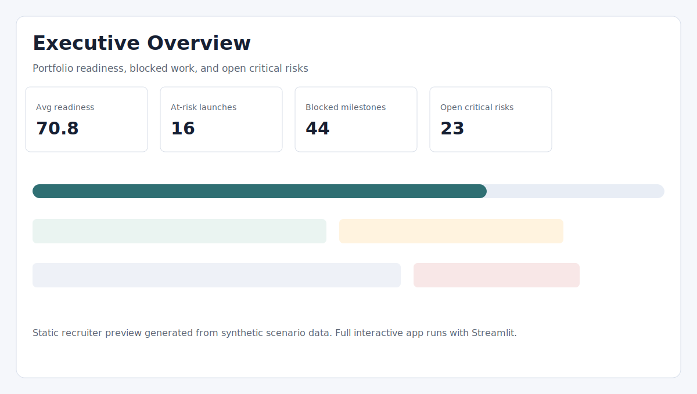
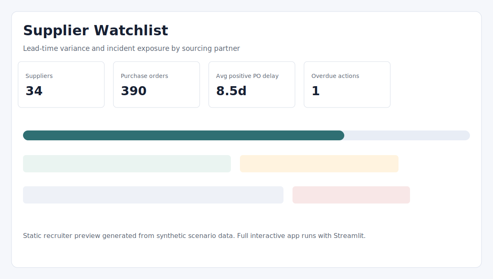
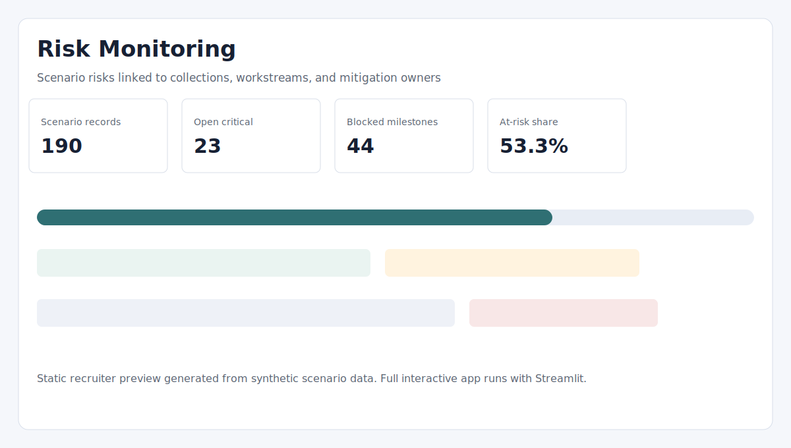

# Fashion Supply Chain Delay & Risk Monitor

A synthetic analytics project for monitoring launch readiness, supplier delay risk, operational blockers, and mitigation ownership across a multi-brand fashion supply chain.

**Live interactive dashboard:** https://fashion-supply-chain-risk-monitor.streamlit.app  
**GitHub repository:** https://github.com/marinadiezz/Fashion_Supply_Chain_Delay_Risk_Monitor

## Project Overview

Fashion launches depend on many connected activities: supplier confirmation, production, quality checks, logistics, warehouse allocation, product content, and market launch readiness. A delay in one workstream can quickly affect downstream launch dates.

This project turns those dependencies into a control-tower style dashboard for weekly PMO, operations, and analytics review. It is designed as a portfolio project for Data Analyst, Data Scientist, Data Engineer, Product/Project Analyst, PMO, and Operations roles.

## Business Questions

The dashboard helps answer:

- Which collections are ready, at risk, or critical before launch?
- Which workstreams and suppliers are creating the most delay pressure?
- Which risks, blockers, and mitigation actions need escalation?
- How should a project or operations lead prioritize the next launch review?

## Tools And Technologies

- Python
- pandas and NumPy
- Streamlit
- Plotly
- Jupyter notebooks
- CSV-based data model
- GitHub for version control
- Streamlit Community Cloud for deployment

## Dataset

The data in this repository is synthetic scenario data generated for portfolio demonstration. It uses public fashion brand and sourcing context for realism, but the line-level purchase orders, milestones, incidents, risks, suppliers, and mitigation actions are not confidential company records.

Current modeled scope:

- 30 collection launch scenarios
- 34 representative suppliers
- 390 purchase orders
- 540 milestones
- 190 risks
- 165 incidents
- 240 mitigation actions

The sample CSV files in `data/raw/` and `data/processed/` are synthetic and safe to publish. No private company exports, credentials, local databases, or confidential raw data are included.

## Methodology

1. Generate synthetic fashion launch data from public portfolio context and fixed random seeds.
2. Transform raw records into enriched operational tables.
3. Calculate readiness, delay, supplier, risk, blocker, and mitigation KPIs.
4. Present the results in an interactive Streamlit dashboard.
5. Deploy the dashboard publicly using Streamlit Community Cloud.

## Key Features

- Executive readiness overview with launch health KPIs
- Delay analysis by workstream, collection, and purchase order
- Risk severity and exposure scoring
- Supplier performance scorecard and watchlist
- Sourcing geography view
- Launch timeline and dependency review
- Mitigation action board
- Scenario simulator for directional PMO discussion
- Static portfolio summary in `docs/index.html`

## Main Insights

- Low-readiness launches usually combine blocked milestones, overdue actions, and unresolved high-severity risks.
- Supplier reliability and lead-time variance affect launch readiness, not only procurement performance.
- E-commerce, logistics, quality, and warehouse tasks become more critical as launch dates approach.
- A useful PMO view should connect signal to ownership: what is blocked, who owns it, which supplier is involved, and what mitigation is due.

## Screenshots

Static recruiter previews are stored in `assets/screenshots/`.







## How To Open The Dashboard

The easiest way to review the project is to open the deployed Streamlit app:

```text
https://fashion-supply-chain-risk-monitor.streamlit.app
```

This opens the full interactive dashboard with filters, tabs, charts, maps, tables, and scenario analysis.

## How To Run Locally

Clone the repository:

```bash
git clone https://github.com/marinadiezz/Fashion_Supply_Chain_Delay_Risk_Monitor.git
cd Fashion_Supply_Chain_Delay_Risk_Monitor
```

Create and activate a virtual environment:

```bash
python -m venv .venv
.venv\Scripts\activate
```

On macOS or Linux, use:

```bash
source .venv/bin/activate
```

Install dependencies:

```bash
pip install -r requirements.txt
```

Regenerate the synthetic data if needed:

```bash
python src/generate_data.py
python src/transform_data.py
```

Run the Streamlit app:

```bash
streamlit run app/streamlit_app.py
```

## Static Portfolio Page

This repository also includes a static HTML summary in:

```text
docs/index.html
```

That file is useful for GitHub Pages or a quick non-interactive portfolio preview. The full dashboard experience is available through the Streamlit app.

## Repository Structure

```text
Fashion_Supply_Chain_Delay_Risk_Monitor/
|-- README.md
|-- .gitignore
|-- requirements.txt
|-- app/
|   |-- components.py
|   |-- streamlit_app.py
|   `-- style.css
|-- assets/
|   `-- screenshots/
|-- data/
|   |-- raw/
|   `-- processed/
|-- docs/
|   `-- index.html
|-- notebooks/
|   |-- 01_data_generation_validation.ipynb
|   `-- 02_eda_kpi_logic.ipynb
|-- src/
|   |-- build_static_portfolio.py
|   |-- calculate_kpis.py
|   |-- generate_data.py
|   |-- risk_scoring.py
|   |-- transform_data.py
|   `-- utils.py
```

## What To Keep In GitHub

This repository should include:

- Source code in `src/` and `app/`
- Synthetic CSV sample data in `data/raw/` and `data/processed/`
- Notebooks in `notebooks/`
- Static portfolio page in `docs/index.html`
- Recruiter preview images in `assets/screenshots/`
- `README.md`, `requirements.txt`, and `.gitignore`

## What Not To Upload

Do not upload:

- `.venv/`, `venv/`, or other local environments
- `__pycache__/`, `.ipynb_checkpoints/`, and cache folders
- `.env`, credentials, API keys, tokens, passwords, or secrets
- Local databases such as `.db`, `.sqlite`, or `.duckdb`
- Private company exports or confidential raw data
- Temporary Office files such as `~$*.docx`
- Large unnecessary files or generated junk

## Limitations

- The records are scenario data, not live ERP, PLM, WMS, logistics, or order-management data.
- The scenario simulator is directional and should not be interpreted as a predictive model.
- Supplier names are representative scenario entities, not disclosed legal suppliers.
- Cost and margin impact are represented through exposure bands rather than detailed financial statements.
- The static HTML page is a portfolio summary; the full interactive experience is in Streamlit.

## Future Improvements

- Add automated dashboard screenshot capture.
- Add a small test suite for KPI and readiness scoring functions.
- Add configurable scenario assumptions for different launch calendars.
- Add exportable weekly review packs for PMO stakeholders.
- Add role-specific views for sourcing, logistics, merchandising, and leadership.

## Portfolio Note

This project is prepared as a public GitHub portfolio case study. It demonstrates analytics product thinking, data modeling, KPI design, operational storytelling, and dashboard implementation using non-confidential synthetic data.
